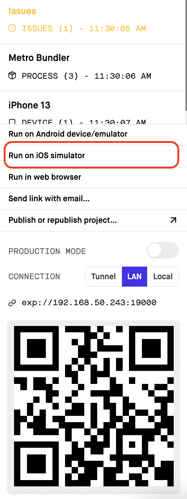

# react native practise (fork by https://github.com/0x-cygnet/rn-starter)

## note: Iphone simulator setting
1. install Xcode
2. install Xcode command line tools
3. open simulator `open -a Simulator`
4. open app with expo  
  
doc: https://docs.expo.dev/workflow/ios-simulator/